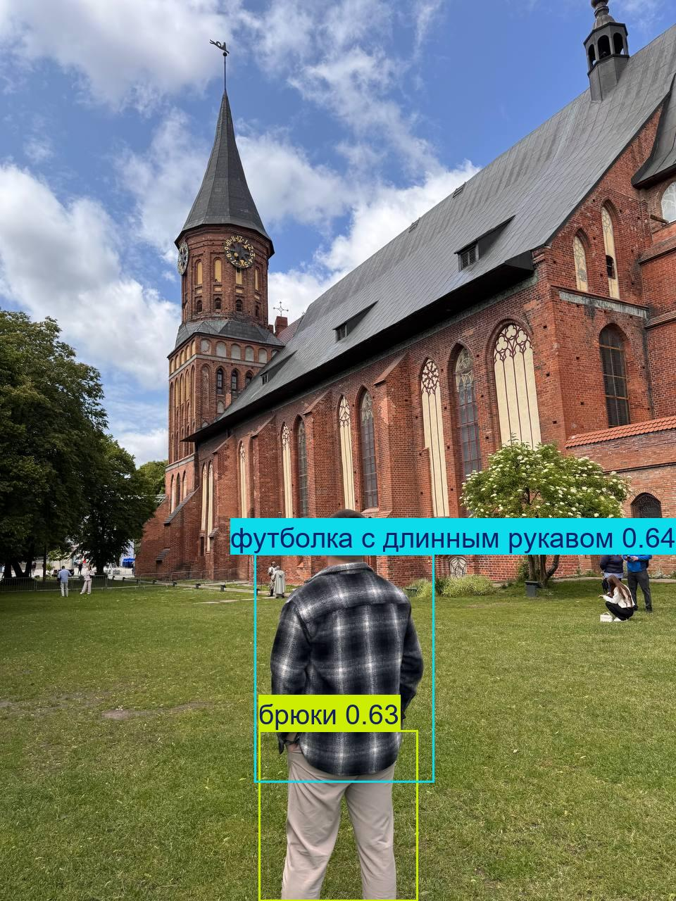
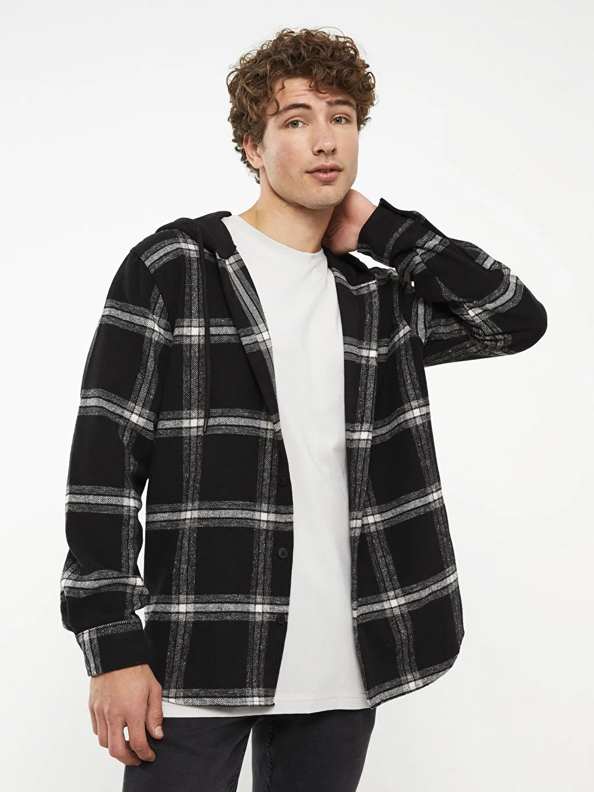

#  YOLO Fashion Detector & Recommender

Pet-проект по распознаванию одежды на фото и подбору похожих товаров из каталога с помощью CV и ML.

##  Цель проекта

Создать систему, которая:

1. Находит одежду на изображении (детекция и классификация)
2. Позволяет пользователю найти **похожие товары** из базы (поиск по эмбеддингам)
3. Работает через **Telegram-бота**, с полным end-to-end пайплайном

---

##  Стек технологий

-  YOLOv8 (Ultralytics) — для детекции и классификации одежды
-  Scikit-learn / torchvision — для базовой классификации
-  CLIP / ConvNeXt — для извлечения эмбедингов
-  FAISS — быстрый поиск похожих вещей
-  Telegram Bot API — фронт-интерфейс
-  Python, Colab, OpenCV, Torch

---

##  Структура проекта

```bash
.
├── data_preparation_and_training.ipynb      # Обработка данных, обучение YOLO и ручного классификатора
├── embedding_search.ipynb                   # Вычисление эмбедингов, поиск похожих вещей
├── dataset_yolo/                            # Аннотированный датасет для YOLO (train/val)
├── runs/                                    # Логи и веса модели
├── examples        
└── README.md
```
##  Детали реализации

###  1. Детекция и классификация одежды
- Обучили модель **YOLOv8m** на 13 классах одежды
- Использованы сильные аугментации и тонкая настройка гиперпараметров
- Для сравнения обучен также базовый классификатор на вырезанных патчах одежды

###  2. Поиск похожих товаров
- Извлекаем эмбединги одежды с помощью **CLIP** или **ConvNeXt**
- Храним эмбединги всех товаров из каталога в **FAISS-индексе**
- По запросу ищем ближайшие векторы и возвращаем наиболее похожие товары

###  3. Telegram-бот
- Пользователь отправляет фото → модель находит и классифицирует одежду
- Затем бот предлагает подобрать похожие вещи из каталога
- Результаты возвращаются с картинками и описаниями товаров

---

##  Результаты

| Метрика                  | Значение |
|--------------------------|----------|
| mAP50 (YOLOv8m)          | 0.73     |
| mAP50-95                 | 0.65     |
| Accuracy (классик модель) | ~0.80    |

---

## 📷 Пример работы бота

<table>
  <tr>
    <td align="center">
      <br/>
      <sub>Входное изображение: детекция и классификация одежды</sub>
    </td>
    <td align="center">
      <br/>
      <sub>Рекомендация похожих товаров из каталога</sub>
    </td>
  </tr>
</table>


---

##  Команда проекта
-  YOLO + классификация + эмбединги + поиск: **Бобков Егор**
-  Backend и Telegram-бот: **Труфманов Михаил**
---

